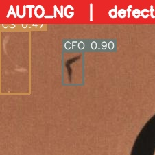

# PCB-Inspector

PCB 동박 표면의 미세 결함 9종을 자동 검출하고 confidence 이중 임계값으로 **자동 불량 / 재검 필요 / 통과**를 판정하는 데스크톱 AOI(자동광학검사) 보조 프로그램.

## 문제 / 해결

- **문제**: 양산 PCB 검사는 검사원의 육안 의존도가 높아 피로·오판이 누적되고, 미세 결함(스크래치·이물 등)은 놓치기 쉽다. 검사 PC에는 보통 GPU가 없다.
- **해결**: 공개 데이터셋(DsPCBSD+)으로 YOLO26s를 **직접 파인튜닝**해 9종 결함을 검출하고, ONNX로 변환해 **GPU 없는 CPU에서 동작**시킨다. confidence 이중 임계값으로 고신뢰 결함만 자동 불량 처리하고 애매한 건만 사람에게 넘겨 검사원 부담을 줄인다.

## 핵심 결과

- **mAP@50 0.843** (DsPCBSD+ val 2,051장으로 재현 검증)
- **9 클래스** 결함 검출 (단락·스퍼·잔여구리·단선·마우스바이트·홀 브레이크아웃·스크래치·도체이물·기판이물)
- **~140ms/img** CPU 추론 (Intel i7-8700, 헤드리스 실측)
- **ONNX 단일 exe 배포** — 파이썬·GPU 설치 없이 더블클릭 실행

## 기술 스택

| 영역 | 스택 |
|---|---|
| 모델 | YOLO26s 파인튜닝 (Ultralytics) |
| 데이터 | DsPCBSD+ — 9 클래스 PCB 표면 결함 |
| 추론 | ONNX Runtime (CPU) — end2end·raw 출력 모두 지원, 자체 NMS |
| GUI | PySide6 (다크 테마, 휠 줌·드래그) |
| 배포 | PyInstaller (Windows exe / macOS .app) |

## 데모



좌측 파일별 판정 리스트(색상) · 중앙 박스 오버레이(휠 줌·드래그) · 우측 임계값 슬라이더(실시간)·결함 테이블·CSV 내보내기.

## 설치 & 실행

```bash
cd app

# uv 사용 시
uv pip install -r requirements.txt
# 또는 pip
pip install -r requirements.txt

# GUI 실행 (models/best.onnx 필요)
python app/main.py
```

`best.onnx`가 없으면 `best.pt`에서 변환한다 (개발 의존성 필요):

```bash
pip install -r requirements-dev.txt
python export_onnx.py --weights models/best.pt
```

배포용 실행 파일 빌드:

```bash
build_exe.bat          # Windows  → dist/PCB-Inspector/PCB-Inspector.exe
bash build_app_mac.sh  # macOS    → dist/PCB-Inspector/
```

## 프로젝트 구조

```
pcb-inspector/
├── app/
│   ├── app/
│   │   ├── __init__.py
│   │   ├── inference.py        ONNX 추론 엔진 + 이중 임계값 판정
│   │   └── main.py             PySide6 GUI
│   ├── models/                 best.pt / best.onnx (+ README)
│   ├── export_onnx.py          PyTorch → ONNX 변환
│   ├── validate_map.py         mAP 재검증 (ultralytics)
│   ├── verify_inference.py     헤드리스 검출 검증
│   ├── build_exe.bat           Windows exe 빌드
│   ├── requirements.txt        런타임 의존성 (고정 버전)
│   └── requirements-dev.txt    export/validate/build 의존성
└── docs/
    ├── metrics/                PR곡선·혼동행렬·val_metrics.csv (실측 증빙)
    ├── diagrams/               검사 파이프라인·판정 플로우차트
    └── screenshots/detections/ 실검출 오버레이 + results.csv
```

## 판정 로직 (이중 임계값)

| 구간 | 판정 | 의미 |
|---|---|---|
| conf ≥ t_high (기본 0.70) | 자동 불량 | 사람 확인 생략 (고신뢰) |
| t_low ≤ conf < t_high | 재검 필요 | 검사원이 확인 |
| conf < t_low (기본 0.25) | 보고 안 함 | 노이즈 억제 |

## 한계 & 다음 단계

- **약한 클래스 보강**: CFO(도체 이물, 0.715)·CS(스크래치, 0.730)의 mAP가 상대적으로 낮음 — 데이터 증강·하드 네거티브 추가 학습 필요.
- **INT8 양자화**: ONNX 모델 양자화로 CPU 추론 속도·메모리 추가 개선.
- **MES 연동**: 판정 결과를 생산실행시스템(MES)에 연계해 로트 추적·불량 통계 자동화.

## 데이터셋 출처

DsPCBSD+ — Roboflow Universe (PCB 결함 공개 데이터셋). 라이선스는 출처 페이지 참조.

## 라이선스

[MIT](LICENSE) © 2026 이재환 (Jaehwan Lee)
